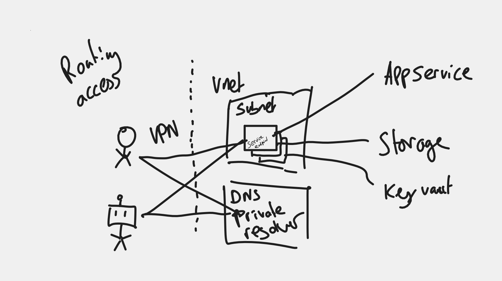

# Demo of azure vnet and VPN client that can be used by humans and also DevOps pipelines

## What is this?

[Lots](https://learn.microsoft.com/en-us/azure/devops/pipelines/agents/docker?view=azure-devops) [of](https://www.cloudwithchris.com/blog/azuredevops-selfhosted-agents-on-azure/) [Azure Documentation](https://azure.github.io/AppService/2021/01/04/deploying-to-network-secured-sites.html) suggests that where you have a virtual network that you've closed off to the world if you want to use CI inc Azure DevOps Pipelines you must deploy either a VM or perhaps a container into the virtual network that should be provisioned with all the build tools you need and also the Azure DevOps Runner that is routing back to the shared co-ordination.

**This is unfavorable for a number of reasons:**

- Concentrated risk on a single component, when it breaks no one can deploy or do anything, if it is compromised the game is lost
- Leaves the question of how to repair and maintain that instance
- The delivery team is operating otherwise serverless vendor native services so there is a skills gap within the team to maintain the vm/container
- It moves our position within the shared responsibility model to a space where we would rather rely on the cloud vendor to be.
- Limited scale and fragility
- Since there is no egress available within the vnet, how do you get the container image in, or update/patch the tools
- Mixes control-plane traffic with data-plane
- Potential for a bad actor to obtain persistence on long lived runner
- Don't need to [firewall ip whitelist all Microsoft managed azure devops runners](https://learn.microsoft.com/en-us/azure/devops/pipelines/agents/agents?view=azure-devops&tabs=browser#communication-to-deploy-to-target-servers) (which could be anyone)
- Requires egress to another service that is not critical for the operational run of the service
- One way for the humans, another has to be maintained for the robots, [equality](https://www.discovermagazine.com/technology/do-robots-deserve-human-rights)!
- Harder to monitor and observe behavior, it's always on.

Overall we appear to have gained more problems than we solved.

## What if...

Given we will require a virtual network gateway with a point-to-site VPN as a break glass (access managed by PIM) for our humans, what if we could use the exact same pattern for our non-human DevOps runners with authentication and routing all managed by AD originated identity. Alerts can all be wired up for unexpected / out-of-hours connections being established.

|  |
| :-----------------------------------: |
|    _Crude white-boarding planning_    |

## Caveats of demo

- **No AD integration:** I wrote this with certificate based auth since it was easier to bootstrap, however in another exercise I did prove this all with AD based authentication including the service principal of the devops runner having access to connect but it was entangled with CPS AD configuration to have as a standalone demo anyone can stand up.
- You'll probably need to rename some bits since some resources require a globally unique name

## How to demo

### Initial terraform apply

```bash
terraform apply --auto-approve
```

The vnet gateway takes about 40mins to start up, so go make some coffee.

It will fail eventually because you're not connected to the vpn with routing or access to the storage account (thats a good thing, proves it works)

### Get the VPN client config, and connect to the VPN

```bash
curl -o client.zip $(az network vnet-gateway vpn-client generate -n gateway -g example-resources | tr -d '"')
unzip client.zip -d client
CLIENTCERTIFICATE=$(cat cnsCert.pem) PRIVATEKEY=$(cat cnsKey.pem) envsubst < client/OpenVPN/vpnconfig.ovpn > vpnconfig.ovpn
rm -r client.zip client
sudo openvpn vpnconfig.ovpn&
```

### Terraform apply again

```bash
terraform apply --auto-approve
```

This should succeed now

### Prove everything works:

```bash
# these should all return 10.0.2.x addresses when on vpn
nslookup cns-examplekeyvault.vault.azure.net
nslookup cnsdemoapp.azurewebsites.net
nslookup cnsstorageaccounttest.blob.core.windows.net
```

```bash
# should fail without being connected to vpn
az keyvault secret list --vault-name cns-examplekeyvault
curl https://cnsdemoapp.azurewebsites.net/
az storage blob download --container-name content --account-name cnsstorageaccounttest --name helloworld
```

Disconnect from the VPN, try the above again.
